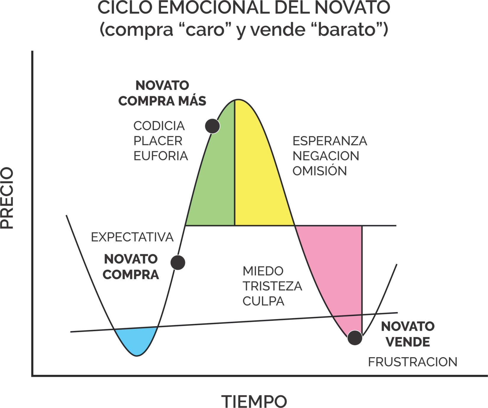

# Nuestra mente no es fiable

Si lo tengo que expresar en números, aprendí que el éxito en el _trading_ depende un 30% de análisis técnico y un 70% de gestión mental y emocional.

En su momento descreí el valor que la psicología representa al momento de operar.

Suponía que analizando gráficos y fundamentos, combinando varios indicadores, iba a lograr beneficios extraordinarios y que la psicología en el _trading_ solo valía para personas débiles, entre las cuales ilusamente no me incluía.

La realidad me demostró lo contrario: si negamos el valor que tienen las emociones y la psicología al momento de operar, perdemos dinero frente a instituciones y verdaderos _traders_.

**Muy pocos novatos estudian más allá del AT. Generalmente pierden y se retiran, o se vuelven adictos y pierden todo.**

_Tienes una ventaja enorme frente a la mayoría, porque cuentas con el apoyo de personas como tú, que están aprendiendo con un loquito como yo, que estudió todo lo que encontró y fundó este espacio para reunirnos._

### El análisis técnico no asegura nada a futuro

En el mercado operamos personas o robots programados por personas y por eso, la certeza no existe a la hora de hacer _trading_.

No cualquiera puede convivir con eso, cuesta abandonar la zona de confort donde nos hacen creer que podemos asegurar nuestro futuro.

Lo siento, pero es físicamente imposible.

Un método de _trading_ no puede prevenir que salgas tarde o de manera prematura de una posición, o que no respetes tu _stop-loss_.

Porque eso dependerá exclusivamente de tus reacciones, que podrás o no desarrolar mental y emocionalmente.

**Lo único que debe motivar tus operaciones es una estrategia de inversión o **_**trading**_** fundada en análisis técnico.**

La esperanza no es objetiva, la intuición puede fallar.

Las probabilidades de que una operación sea exitosa al estar motivada de las emociones, es la misma de que salga cara o cruz al tirar una moneda.

En ese caso no estarías haciendo _trading_ sino apostando. Y siempre vas a perder, porque tu dinero no es ilimitado y te vas a quedar sin dinero para continuar tirando la moneda.

&#x20;Ahí se ubica el 90% del mercado que pierde dinero.

Y prácticamente nadie lo menciona, porque es algo que genera sentimientos muy desagradables: culpa, miedo, baja autoestima, bronca, ira, pena.

Duele mucho y parece más simple intentar negarlo, aunque sea imposible hacerlo.

Si no gestionas sentimientos, pensamientos y emociones, repitirás errores cíclicos, y nada ni nadie te podrán sacar de esa situación más que tú mism@.

**Meditar es la práctica por naturaleza del trader criptonauta, pero también observamos lo que nos pasa desde la psicología.**

Leí muchos libros académicos, que pueden ser aburridos para quienes no tienen tanto interés en la psicología como profesionales o algunos curiosos.

Menciono de manrea simple con lo que te vas a encontrar, y te acerco métodos sencillos para que sepas por dónde comenzar a superarlos.

### Deberás deschipearte con nosotros

Desde que somos chicos nos enseñaron a ser proactivos, productivos, hacer todo el tiempo cosas, insistir hasta el cansancio o a “no rendirnos jamás”.

Las instituciones (escuela, universidad, trabajo, familia) desarrollan la proactividad al máximo porque es lo que la sociedad del consumo necesita para funcionar como tal.&#x20;

No necesita _traders_, necesita piezas de engranajes que cumplan funciones específicas.

La _programación mental_ que recibimos socialmente nos lleva a cortar profits al hacer trading y arriesgar en las pérdidas porque nos acostumbran a evitar sentimientos negativos.

> No es casualidad encontrar tantos químicos en la calle y tantas apps de citas, una noche de sexo o una línea de cocaína funcionan como parche del día a día que tolera la mayoría.\
> \
> Muy pocas instituciones son aliadas de las personas.

En el siglo XXI todo va a mil, no hay lugar para la paciencia.

La vida gira en torno a una vorágine ininterrumpida de deseo: terminar la escuela y comenzar la universidad, graduarse y comenzar la carrera profesional, iniciar una relación de pareja y tener lo antes posible hijos, comprar el carro, la casa, el yate, etc.

Eso solo hará que pierdas dinero si intentas hacer trading. Porque solo funciona si el tiempo que dedicas es proporcional al dinero que obtienes.

**Y en el trading te irá mejor practicando mucho y operando poco, como si fueras un bateador de béisbol.**

No se trata de comprar y vender todo el tiempo, sino de hacerlo cuando se confirme tu estrategia.&#x20;

Pasarás mucho tiempo en tu setup, estrategia e incluso disfrutando otras actividades para estar tranquilo/a y tomar decisiones conscientes.

Fijar y respetar un stop-loss equivale a asumir pérdidas y es una acción que no forma parte de nuestra enseñanza cotidiana porque la reacción humana frente al dolor es la negación.

Y a eso le sumamos el adoctrinamiento social.

_Las materias aplazadas en la escuela se recuperan, las historias de amor románticas que se ven en el cine o en las series, son eternas._

En una realidad paralela, las personas solo estudian lo que quieren y lres resulta interesante, y no se anclan a relaciones o conceptos que generen tantas responsabilidades.

**Intentamos torcer el destino y solo generamos problemas.**

Adoptar el verdadero trabajo de un _trader_, no es algo que se consigue leyendo. Cambios en estructuras tan fuertes de pensamiento requieren entrenamiento.

Y por eso deberás practicar, compartiendo. Piensa que estás en la escuela y aprendemos entre todos.

Si te interesa tu trading te sugiero sumar a tu vida todo lo que sientas que aporta a tu salud mental y emocional.

Artes marciales, meditación, yoga, programación neurolingüística, hipnosis, ejercicio y _tapping_ (EFT), salir a caminar, escuchar música, pintar, dibujar, lo que se te ocurra estará bien.&#x20;
