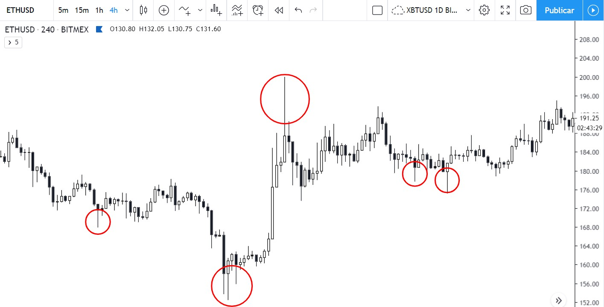
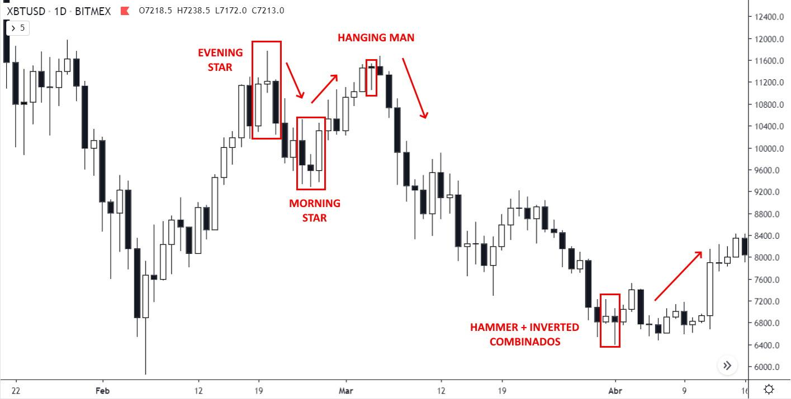
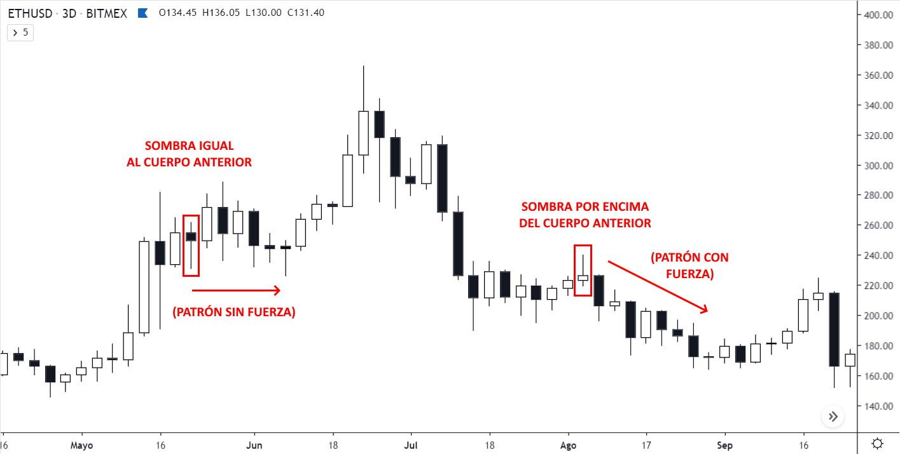

# Patrones criptonautas

Un título común para este capítulo hubiera sido _"Velas japonesas para dummies"_.

Tal vez te guste y hasta te parezca gracioso...

A mí me parece todo lo contrario.

<figure><figcaption>
<em><strong>¿Por qué alguien se sentiría a gusto buscando algo "para tontos"?</strong></em>
</figcaption></figure>

Aquí no te trataremos como si fueras tont@, porque de hecho no reconocemos tont@s más que como una manera despectiva de discriminación.

Todos tenemos capacidades diferentes, y el trading irá mejor con algunas u otras personas. Pero no subestimaremos tus capacidades, sino al contrario.

**Durante este curso vas a cultivar tu mérito, auto-estima y desarrollar confianza personal como nunca antes.**

### Velas japonesas para Criptonautas

Las velas muestran en los gráficos la mayor info posible en relación a las variaciones del precio en un período determinado.

Nos cuentan la apertura y cierre en ese período, pero también sus mínimos, máximos e incluso el interés de compra/venta de la mayoría.

> **Steve Nilson**, en sus libros [“Japanese Candlestick Charting Techniques”](https://www.amazon.com/Japanese-Candlestick-Charting-Techniques-Contemporary-ebook/dp/B00CS74GBM) y “Más allá de las velas” _(en español e impreso)_ desarrolla el **ABC de nuestro trading.**
>
>
>
> **Deberás leer a Nison o al menos la info que encuentres relacionada en nuestro foro y Discord.**

El trading incorpora conocimiento desde muchas áreas. Una vez aprendida, requiere muy poco tiempo operativo para generar rentabilidad.

_Las lecturas de Steve Nison son "obligatoriamente sugeridas"! Pero aún así, deberás practicar, porque no hay manera de que puedas aprender trading sin hacerlo._

### Aprendemos sobre velas practicando

Puedes leer todos los libros sobre precio que existen, y seguir sin aprender a operar. Pero también puedes aprender practicando y solo leyendo este libro.

El mercado tiene básicamente tres momentos: alcista, lateral y bajista. En el primero los precios _suben_, en el lateral se mantienen y en el último, _caen_.

**Mi estrategia es muy simple, opero reversiones en canales tendenciales o laterales previamente definidos.**

Así que los patrones que menciono a continuación indican reversión frente a un pequeño _swing_ alcista o bajista.&#x20;

Las figuras pueden estar compuestas de una, dos, tres o incluso más velas consecutivas.

### **1) Vela grande invertida**

* Se forma con dos velas, el cuerpo de la segunda debe necesariamente igualar, o mejor aún, superar al cuerpo de la anterior.
* Mientras mayor sea el cuerpo de la segunda vela respecto de la primera, más fuerza tiene el patrón.

### 2) Triplete de reversión

* Patrón de tres velas. Luego de una alcista o bajista, se presenta una de cuerpo pequeño con una larga mecha, y se completa con otra en sentido contrario a la primera.
* Mientras mayor sea la mecha, más relevancia tiene el patrón. Y lo mismo aplica al cuerpo de la tercer vela que forma el triplete.

En el primer círculo de izquierda a derecha, notarás que el patrón no tuvo fuerza, porque la segunda vela que lo compone no lo tuvo.

Luego verás que se formó un triplete con más de 3 velas, y varias mechas seguidas...

Así es el mercado, y por eso debemos aprender a analizar en contexto, ya no de manera excesivamente analítica.

### 3) Martillos

* Patrón de única vela. Su mecha _(sombra o cola)_ al menos debe duplicar su cuerpo.
* Mientras mayor sea la mecha, mayor es la probabilidad de que el precio se devuelva en dirección contraria.

### 4) Ahorcado

_Aquí verás te acerco todos los patrones juntos y con sus nombres en inglés. No busques por ahora relaciones entre ellos, mejor enfocate en reconocerlos._

> _Son más simples las definiciones en nuestro idioma, porque en términos prácticos da igual el nombre de las cosas._\
> __\
> _El "hanging man" es el ahorcado._

* Patrón de única vela. No tiene tanta fuerza como los martillos, pero indica agotamiento en la presión del swing.
* Si la cola o sombra se produce fuera del rango de precios de la vela anterior, tiene más relevancia.

## \[EJERCICIO PRÁCTICO 5]

Reconoce al menos 5 patrones de cada uno de los mencionados y comparte tu imagen en este posteo del foro.

Deberás compartir 5 patrones de velas envolventes, 5 tripletes, 5 martillos y 5 ahorcados.

_Si encuentras más, aprenderás más. Pero si encuentras menos, aprenerás menos._
