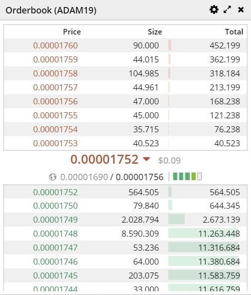
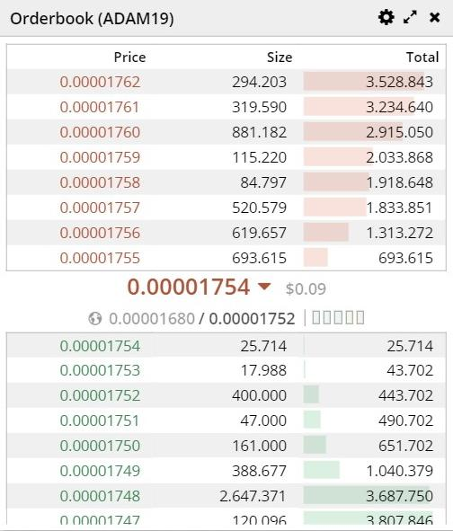
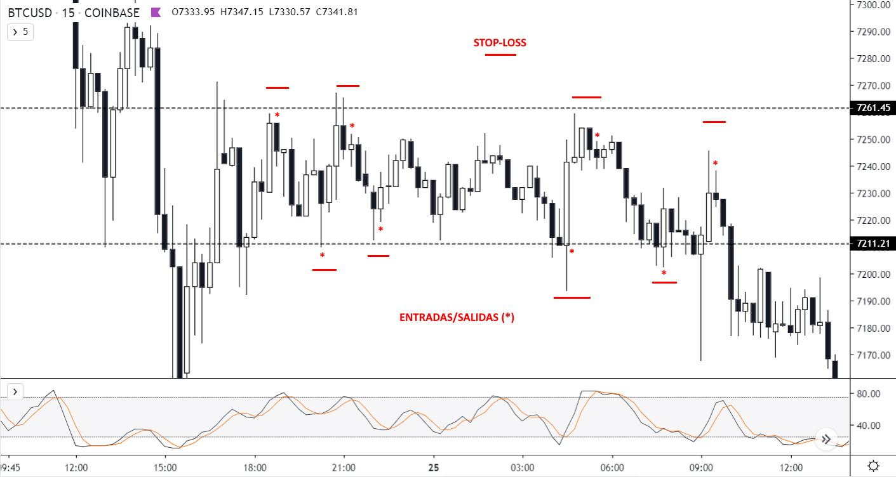

# Order book y order flow

El order book (libro de órdenes) es el registro de órdenes de tipo limit abiertas en el instante en el que estás viendo un exchange.

Esto será útil para que definas tu entrada haciendo scalping.

onde se vea mayor cantidad de compradores o vendedores en el libro de órdenes, se entiende que hay una mayor intención de comprar o vender.

Si hay abiertas más órdenes de compra, el precio tenderá a aumentar su valor, mientras que, si existen más órdenes de venta, a disminuir.

&#x20;

Las siguientes imágenes puede dar luz en este asunto:

Al momento de definir tus entradas o salidas del mercado, el libro de órdenes puede confirmar el momento exacto de tus operaciones. Si decidís comprar a _long_ por visualizar un patrón de velas japonesas cerca del soporte que enmarca una zona lateral o período tendencial, el libro de órdenes debería mostrar mayor presión compradora al momento de ingresar; lo mismo puede aplicarse en el sentido inverso al ingresar en una posición a _short_.

&#x20;

Otra manera en la que suelo utilizar el libro de órdenes, es para definir la toma ganancias. Si la sensación del mercado muestra una fuerte presión inversa a la que opero y el precio en ese momento se encuentra en el gráfico cerca de una media móvil, suelo tomar ganancias y asegurar la posición.

Como repetí varias veces, el conjunto de pequeñas ganancias, otorga con paciencia ganancias mayores, y la conjunción de distintos indicadores aporta más fiabilidad a las operaciones.

&#x20;

Algunos _traders_ experimentados, sobre todo quienes realizan _scalping_ en Forex, suelen trabajar únicamente con el _order book_ porque analizado correctamente puede indicar, por ejemplo, soportes, resistencias e incluso agotamientos de tendencias.

La información que muestra es realmente muy útil, pero tiene la contrapartida de que no detalla órdenes ocultas (así operan _traders_ institucionales) y además se puede manipular. Existen técnicas reconocidas y prohibidas en determinados mercados: _spoofing_, _wash trading_, _layering._

Te aconsejo utilizar el _order book_ para complementar el resto del análisis técnico que menciono en este libro y no como única herramienta de _trading_. Si operás en otros mercados, tené siempre presente que el mercado de criptomonedas tiene sus particularidades.

## De qué manera fijar el stop-loss

Un error clásico entre los recién iniciados es fijar un _stop-loss_ demasiado cerca de la apertura de la posición y suponer que el mismo no se va a ejecutar. Si bien el análisis técnico otorga sentido a las operaciones, existen variaciones mínimas en el precio que deben ser contempladas para evitar que se ejecuten _stop-loss_ ante un correcto análisis.

La posición necesita espacio para “respirar”. Como regla general te recomiendo que el _stop-loss_ nunca supere el 5-10%. Si esperás un movimiento en contra de mayor longitud, tal vez puedas evaluar una mejor entrada.

&#x20;

**ACLARACIÓN**: si en tu estrategia obtenés resultados positivos con SL en otros valores (recordá que te envié una planilla para mantener eso controlado), podés usar los _stop-loss_ donde quieras. Siempre hablo desde mi experiencia y mi estrategia, la tenés que adaptar a tu estilo.

Como podés apreciar en los ejemplos, podés fijar los _stops_ apenas por encima o debajo del valor donde la mayoría los colocaría (cruce exacto con una media móvil, números enteros, valor de una resistencia inmediatamente anterior, cierres anteriores de velas) porque es probable que _traders_ experimentados utilicen esos _stops_ en su beneficio deslizando el precio hacia los mismos y luego generando movimientos a la inversa.

&#x20;

Pienso que lo ideal es utilizar cierres de velas anteriores al momento de fijar SL pero a veces complemento con medias móviles, _market_ (o _volume_) _profile_. Podés usar Fibonacci (aunque es algo que personalmente no utilizo) o lo que te quede cómodo y genere resultados. Recordá que además de conocer mi método, podés usar las herramientas que consideres útiles.

&#x20;

Mover _el stop-loss_ es una habilidad que se aprende con mucha práctica. No existe una regla fija acerca de cuándo es recomendable hacerlo, es algo que raramente otorga beneficios por lo que te aconsejo que solo lo hagas cuando te sientas realmente cómodo al analizar las posiciones y confíes en que vale la pena asumir ese riesgo.

Lo más prudente cuando el precio gira _en tu contra_, sería salir de la posición y reingresar con un nuevo análisis. Lo que se pretenda hacer sin análisis previo, aumenta los riesgos y el margen de error.

## IMPORTANTE: STOP-LOSS EN BITMEX

En el próximo capítulo voy a detallar puntualmente de qué manera fijar el _stop-loss_ en la plataforma donde se opera la estrategia. Es FUNDAMENTAL que prestes atención a ese contenido porque así vas a evitar que tu posición se vea liquidada y pierdas todo el dinero invertido en ella, en caso de una variación fuerte en el mercado.
